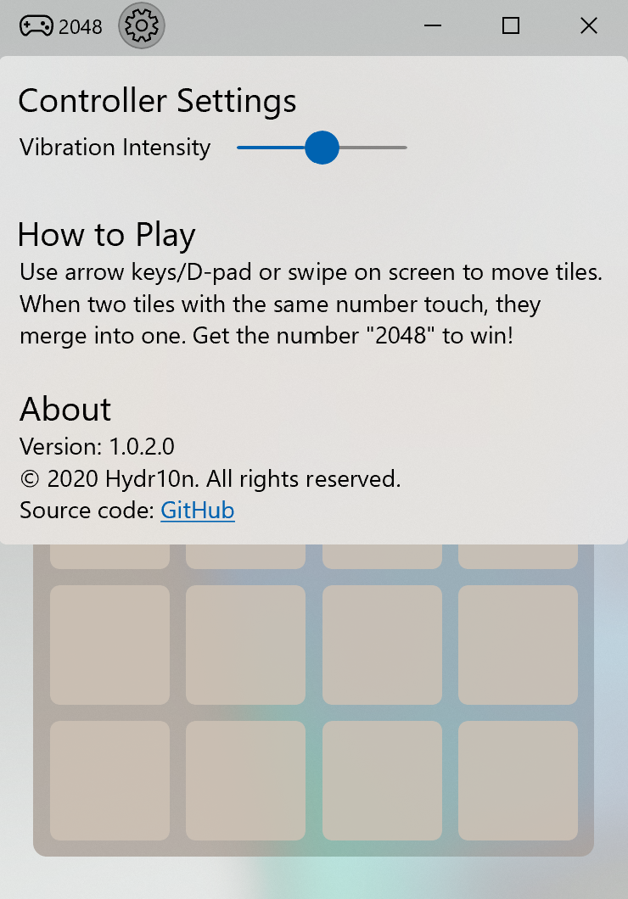

# Game 2048

This project is a UWP version of the well-known game 2048 with extended layouts (including 4 x 4, 5 x 5, 6 x 6) and beautiful Fluent Design for Windows 10 platform; besides, keyboard, mouse, touchscreen and Xbox certified/compatible controller are all supported to play the game!

### How to Play
Use arrow keys/D-pad or swipe on screen to move tiles. When two tiles with the same number touch, they merge into one. Get the number "2048" to win!

## Minimum Build Requirements
* Microsoft Visual Studio 2019 IDE with Universal Windows Platform development workload installed
* Microsoft Windows 10 SDK (10.0.17763.0)

